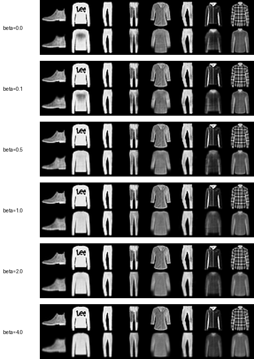
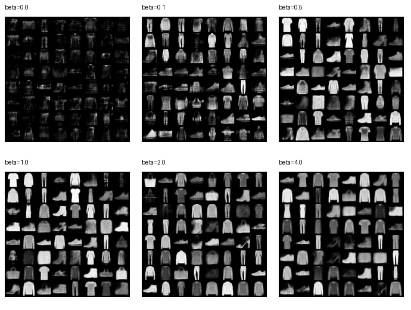

# β 系数扫描开放探索

本文围绕一个小问题展开：当 VAE 损失中的 KL 权重 `beta` 从小到大变化时，模型的重构质量、KL 大小和先验采样质量如何变化？

基础对照实验已经比较了 `beta=0` 和 `beta=1`。这里进一步加入 `beta=0.1`、`0.5`、`2.0` 和 `4.0`，观察从弱 KL 到强 KL 的连续趋势。

## 实验设置

所有实验保持主要训练设置一致，只改变 `beta`：

| setting | value |
|---|---|
| dataset | Fashion-MNIST |
| model | MLP VAE |
| hidden dims | `[400, 200]` |
| latent dim | `16` |
| batch size | `128` |
| epochs | `20` |
| learning rate | `0.001` |
| seed | `42` |
| device | CUDA |

运行配置包括：

```text
configs/fashion_mnist_beta0.yaml
configs/fashion_mnist_beta0_1.yaml
configs/fashion_mnist_beta0_5.yaml
configs/fashion_mnist_beta1.yaml
configs/fashion_mnist_beta2.yaml
configs/fashion_mnist_beta4.yaml
```

## 定量结果

下表由 `scripts/compare_runs.py` 从各实验目录中的 `evaluation.json` 和 `metrics.json` 读取生成。

| run | beta | test reconstruction | test KL | test total |
|---|---:|---:|---:|---:|
| fashion_mnist_beta0 | 0.0 | 214.24 | 297.92 | 214.24 |
| fashion_mnist_beta0_1 | 0.1 | 215.64 | 37.26 | 219.36 |
| fashion_mnist_beta0_5 | 0.5 | 223.13 | 17.25 | 231.75 |
| fashion_mnist_beta1 | 1.0 | 228.38 | 12.19 | 240.57 |
| fashion_mnist_beta2 | 2.0 | 233.06 | 9.31 | 251.69 |
| fashion_mnist_beta4 | 4.0 | 242.32 | 6.51 | 268.37 |

这里不直接比较不同 `beta` 的 `test_total`，因为每个设置对 KL 的权重不同。更合理的比较方式是分别观察 reconstruction loss、KL loss 和生成图像质量。

主要趋势很清楚：随着 `beta` 增大，test reconstruction loss 上升，而 test KL 下降。这说明更强的 KL 正则会迫使近似后验更接近标准正态先验，但会牺牲一部分重构精度。

## 重构结果

{ width=75% }

`beta=0` 和 `beta=0.1` 的重构最清晰，轮廓和对比度更接近输入图像。`beta=0.5` 开始出现更明显的平滑，但主要类别仍能较好保留。

当 `beta` 增大到 `1.0`、`2.0` 和 `4.0` 时，重构图像逐渐变得更平滑，衣服纹理和局部细节减少。`beta=4.0` 的重构损失最高，图像也最接近“平均化”的结果。

## 先验采样结果

{ width=88% }

`beta=0` 的 prior samples 明显发暗且混乱，很多样本只有模糊纹理。这说明没有 KL 正则时，encoder 学到的 latent distribution 与标准正态先验不匹配，从 `N(0, I)` 随机采样得到的 latent 不一定落在 decoder 熟悉的区域。

`beta=0.1` 已经显著改善 prior samples，说明很小的 KL 权重也能有效约束潜空间。`beta=0.5` 和 `beta=1.0` 的采样图中可识别衣物比例较高，整体比低 beta 更稳定。

`beta=2.0` 和 `beta=4.0` 的采样仍然稳定，但生成结果更趋于保守和模板化。强 KL 让 latent space 更贴近先验，但也会限制 latent 表达输入细节的能力。

## 结果解释

这组实验体现了 VAE 中 reconstruction 与 regularization 的权衡：

- 小 `beta` 更接近普通 autoencoder，重构效果更好，但 latent space 更难与标准正态先验对齐。
- 大 `beta` 更强调 KL 正则，prior sampling 更稳定，但重构细节被压缩。
- 中间值 `beta=0.5` 和 `beta=1.0` 在本实验中表现为较合理的折中：重构损失没有过高，prior samples 也比较可识别。

从指标看，`beta=0.1` 已经把 KL 从 `297.92` 降到 `37.26`，但 reconstruction loss 只从 `214.24` 增加到 `215.64`。这说明轻量 KL 正则可以显著改善 posterior-prior 匹配，同时保留较好的重构能力。

## 结论与局限

本次开放探索支持以下结论：KL 权重越大，近似后验越接近标准正态先验，prior sampling 越可靠；但过强 KL 会降低重构质量，并使生成样本更平均化。

当前实验仍然有限：只使用 MLP VAE 和 Fashion-MNIST，且每组训练 20 epochs。后续可以进一步尝试卷积 VAE、更长训练轮次，或使用 latent interpolation 观察不同 `beta` 下潜空间连续性是否更明显。
